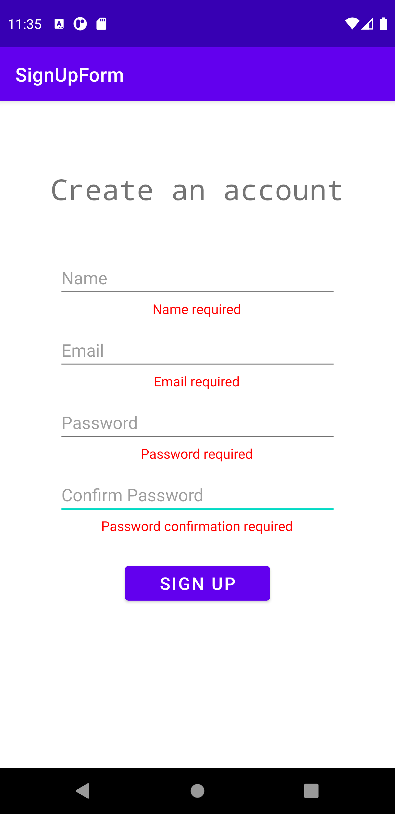

# SignUpForm Application
This app is a simple android form. When users first launch the app, they
will see 4 input fields and a submit button. There are also 4 hidden TextViews
that is used to display error messsages.

## Verification
When the submit button is clicked, it sends all the input fields
for verification. It will return an error message if any of the fields
are empty, if the email provided isn't a valid email pattern, or if the
two passwords do not match.

## Success
When the submission is a success, it returns a message at the bottom that
says welcome, along with the name provided by the user.

## Error
When there is an error, an error message is displayed under the input fields.
When the submit button is clicked again, if the error is corrected, the error
message will disappear.

### Invalid email and password mismatch

### All fields empty
